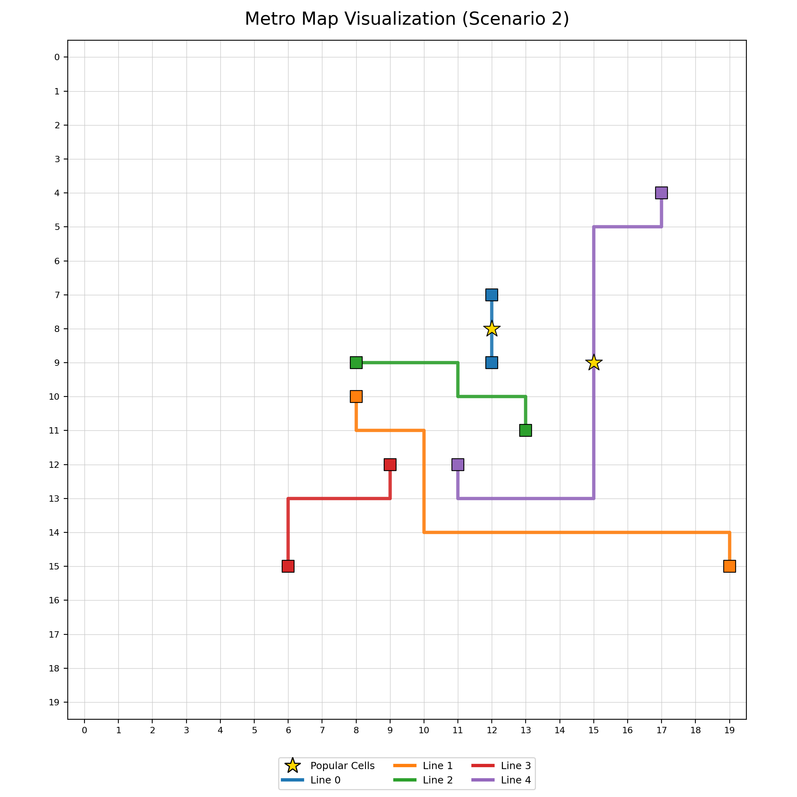

# Solving Metro MAP using SAT Solver

This repository contains our C++ solution which designs a general problem into a CNF form which can be used by SAT solvers

## Build & Run

1) Build encoder and decoder
```bash
cd src
./compile.sh
```

2) Run encoder with the input file, which will generate satinput file
```bash
./run1.sh test
```

3) Run the miniSAT solver with satinput file in DIMACS format
```
./miniSAT test
``` 

5) Run the decoder to decode the model generated by miniSAT in the test.satouput file
```
./run2.sh test
```

6) Validate format and score and get the visual image
```bash
python3 format_checker.py test
python3 visualize_metro.py test.city test.metromap -o case_001_viz.png
```

## TEST CASE
```
2
20 20 5 4 2
12 9 12 7
8 10 19 15
13 11 8 9
9 12 6 15
11 12 17 4
12 8 15 9
```


## RESULT

